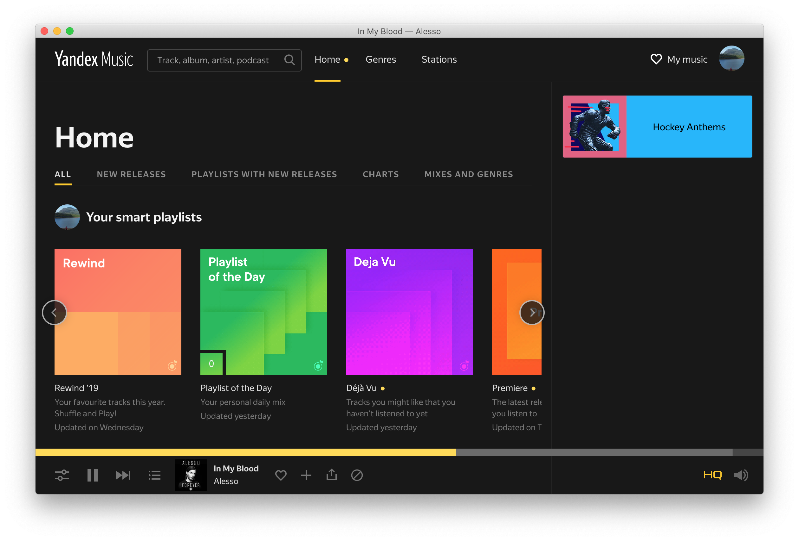

# Yandex music electron based desktop app

Support media keys like play/pause/prev/next



# Build
```bash
npm run build-{mac|win32|linux}
```

Additional cli info you can find here: https://www.electronforge.io/cli#make    

# Note
If app cant bind global shortcut on macOS ≥ 10.14 Mojave, you should grant access to the app in Settings -> Security & Privacy -> Accessibility.
